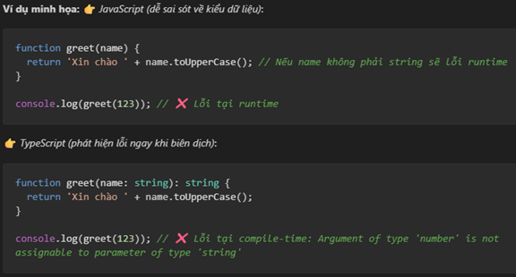
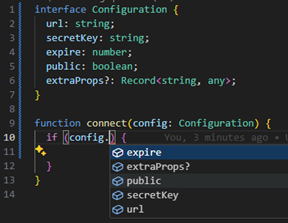

# 🧩 Phần 2: Typescript, cách khai báo kiểu dữ liệu trong Typescript

## 2.1. Một số đặc điểm của javascript

### Ứng dụng của javascript
| Loại ứng dụng         | Công nghệ tiêu biểu         | Nền tảng chạy           |
| --------------------- | --------------------------- | ----------------------- |
| 🌐 Web Frontend       | React, Angular, Vue         | Trình duyệt             |
| ⚙️ Web Backend        | Node.js, NestJS             | Server                  |
| 📱 Mobile             | React Native, Ionic         | Android / iOS           |
| 🖥️ Desktop           | Electron, Tauri             | Windows / macOS / Linux |
| ☁️ Cloud / Serverless | AWS Lambda, Azure Functions | Cloud                   |
| 💻 CLI Tools          | Node.js, Commander          | Terminal                |
| 🧠 Machine Learning   | TensorFlow.js, D3.js        | Browser / Node          |
| 🎮 Game               | Phaser, Three.js            | Browser                 |
| 🤖 IoT                | Johnny-Five, Espruino       | Board / Device          |

### Phiên bản quan trọng ES6 
1. ES6 là phiên bản thứ 6 của ECMAScript, còn gọi là ECMAScript 2015.

2. Ra mắt vào năm 2015, ES6 mang đến nhiều tính năng mới, giúp JavaScript mạnh mẽ, dễ đọc, dễ bảo trì hơn.

3. Mục tiêu: Cải thiện cú pháp, hỗ trợ lập trình hướng đối tượng, và giải quyết các hạn chế của ES5.

4. Tài liệu tiếng việt: https://anonystick.com/blog-developer/ecmascript-es6-khong-can-hoc-nhieu-chi-hoc-dung-nhung-tinh-nang-nay-2021041999690785
### Đặc điểm
| Đặc điểm             | Mô tả                                                         | Ví dụ                                  |
| -------------------- | ------------------------------------------------------------- | -------------------------------------- |
| 🧵 Single-threaded   | Chỉ có 1 luồng thực thi, dùng Event Loop để xử lý bất đồng bộ | `setTimeout`, `Promise`, `async/await` |
| 🧮 Weakly typed      | Cho phép ép kiểu ngầm                                         | `5 + "10" → "510"`                     |
| 🔀 Dynamically typed | Kiểu được xác định khi chạy, có thể thay đổi                  | `let x = 10; x = "hi"`                 |

## 2.2 Typescript

* **Nhà phát triển:** Microsoft, do **Anders Hejlsberg** (người tạo ra C#) dẫn đầu.
* Mở rộng từ JavaScript bằng cách bổ sung **hệ thống kiểu tĩnh** (static typing) và các tính năng **hướng đối tượng (OOP)**. 

### Ưu điểm
1. Phát hiện lỗi sớm: Trình biên dịch TypeScript kiểm tra kiểu dữ liệu (type) trước khi chạy tại quá trình biên dịch góp phần giảm thiểu lỗi runtime.

2. Tự động gợi ý thông minh (IntelliSense): IDE hiểu kiểu dữ liệu, giúp gợi ý phương thức, thuộc tính nhanh chóng và chính xác.

3. Tính năng ngôn ngữ mở rộng: TypeScript cung cấp thêm interface, enum, generic và type alias giúp mô hình hóa code tốt hơn so với javascript.

4. Khả năng tương thích hoàn toàn: Code JavaScript hợp lệ đều chạy được trong TypeScript.

### Nhược điểm

1. Cần đầu tư thời gian để học các kiểu dữ liệu và cách sử dụng các tính năng của typescript.
2. Tăng độ phức tạp của dự án, lập trình viên cần hiểu cả javascript và typescript
3. Typescript chỉ phát hiện lỗi tại quá trình biên dịch, không phát hiện được toàn bộ lỗi runtime.
4. Nếu thiếu kỷ luật nhóm thì sẽ mất ý nghĩa an toàn.
5. Angular mặc định bắt buộc phải sử dụng typescript

## 2.3 Cách hoạt động của Typescript

## 2.4 Tài liệu

https://www.typescriptlang.org/docs/

